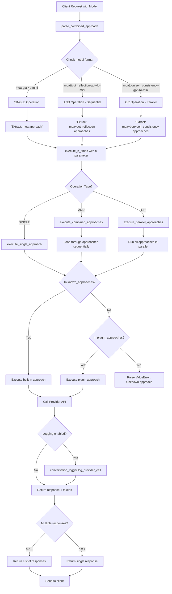
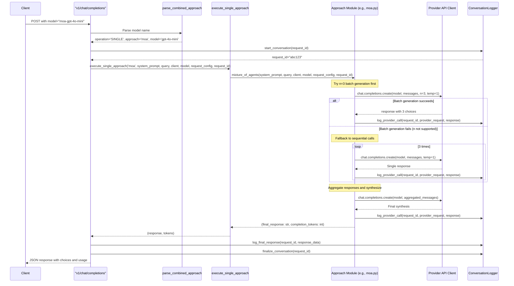

# OptiLLM Development Guide

## Project Overview

OptiLLM is an **OpenAI API-compatible optimizing inference proxy** that implements 20+ state-of-the-art techniques to dramatically improve LLM accuracy on reasoning tasks without training. It acts as a middleware layer between clients and LLM providers, applying optimization approaches before/after API calls.

**Core Value Proposition**: Apply inference-time compute optimization to boost accuracy 2-10x on math, coding, and logical reasoning tasks using any OpenAI-compatible endpoint.

## Architecture

### High-Level Component Map

The following diagram shows the complete architecture discovered using Codanna code analysis:

```mermaid
graph TB
    subgraph "Client Layer"
        C[Client Request]
    end

    subgraph "Flask Server (server.py)"
        A["/v1/chat/completions Endpoint"]
        B[parse_combined_approach]
        C1[Request Config Handler]

        subgraph "Execution Engine"
            E1[execute_single_approach]
            E2[execute_combined_approaches]
            E3[execute_parallel_approaches]
            E4[execute_n_times]
        end

        subgraph "Logging & Batching"
            L1[ConversationLogger]
            L2[RequestBatcher]
        end
    end

    subgraph "Built-in Approaches (optillm/)"
        subgraph "Sampling Approaches"
            MOA[mixture_of_agents - moa.py]
            BON[best_of_n_sampling - bon.py]
            SC[self_consistency - self_consistency.py]
        end

        subgraph "Reasoning Approaches"
            COT[cot_reflection - cot_reflection.py]
            PS[plansearch - plansearch.py]
            LEAP[leap - leap.py]
            RE2[re2_approach - reread.py]
        end

        subgraph "Search Approaches"
            MCTS[chat_with_mcts - mcts.py]
            RSTAR[RStar - rstar.py]
        end

        subgraph "Advanced Approaches"
            CEPO[cepo - cepo/cepo.py]
            MARS[multi_agent_reasoning_system - mars/]
            PVG[inference_time_pv_game - pvg.py]
        end

        subgraph "Verification Approaches"
            Z3[Z3SymPySolverSystem - z3_solver.py]
            RTO[round_trip_optimization - rto.py]
        end

        NONE[none_approach - Passthrough]
    end

    subgraph "Plugin System (optillm/plugins/)"
        P1[memory_plugin.py]
        P2[privacy_plugin.py]
        P3[json_plugin.py]
        P4[executecode_plugin.py]
        P5[deep_research_plugin.py]
        P6[deepthink_plugin.py]
        P7[mcp_plugin.py]
        P8[router_plugin.py]

        PL[Plugin Loader - load_plugins]
    end

    subgraph "Provider Clients"
        OAI[OpenAI Client]
        CER[Cerebras Client]
        AZU[Azure OpenAI]
        ZAI[Z.ai Client]
        LITE[LiteLLM Client]
        LOCAL[Local Inference - inference.py]
    end

    C --> A
    A --> B
    B --> C1
    C1 --> L2
    L2 --> E4
    E4 --> E1
    E4 --> E2
    E4 --> E3

    E1 --> MOA
    E1 --> BON
    E1 --> SC
    E1 --> COT
    E1 --> PS
    E1 --> LEAP
    E1 --> RE2
    E1 --> MCTS
    E1 --> RSTAR
    E1 --> CEPO
    E1 --> MARS
    E1 --> PVG
    E1 --> Z3
    E1 --> RTO
    E1 --> NONE

    E1 --> P1
    E1 --> P2
    E1 --> P3
    E1 --> P4
    E1 --> P5
    E1 --> P6
    E1 --> P7
    E1 --> P8

    PL -.Auto-loads on startup.-> P1
    PL -.Auto-loads on startup.-> P2
    PL -.Auto-loads on startup.-> P3
    PL -.Auto-loads on startup.-> P4
    PL -.Auto-loads on startup.-> P5
    PL -.Auto-loads on startup.-> P6
    PL -.Auto-loads on startup.-> P7
    PL -.Auto-loads on startup.-> P8

    MOA --> OAI
    BON --> OAI
    NONE --> OAI
    COT --> CER
    MARS --> AZU
    P1 --> ZAI
    P7 --> LITE
    CEPO --> LOCAL

    MOA -.logs.-> L1
    BON -.logs.-> L1
    NONE -.logs.-> L1
    E1 -.logs.-> L1
```



### Request Flow Pattern

```
Client Request → Flask Server (server.py) → Approach Selection → Execute Pipeline → Provider API → Response
```

**Key architectural points:**

-   **Model prefix routing**: Approaches are specified via model name prefix (e.g., `moa-gpt-4o-mini`)
-   **Three execution modes**: SINGLE (one approach), AND (sequential pipeline), OR (parallel execution)
-   **Plugin system**: Dynamic loading from `optillm/plugins/` with `SLUG` and `run()` interface
-   **Approach chaining**: Combine via `&` (sequential) or `|` (parallel), e.g., `moa&cot_reflection-gpt-4o-mini`

### Model Prefix Routing Flow

This diagram shows how model names are parsed and routed to execution pipelines:



### Core Components

1. **Entry Point** ([optillm.py](optillm.py)): Thin wrapper calling `optillm:main()`
2. **Server** ([optillm/server.py](optillm/server.py)): Flask app with `/v1/chat/completions` endpoint
3. **Approaches** ([optillm/](optillm/)): 20+ optimization techniques as individual modules
4. **Plugins** ([optillm/plugins/](optillm/plugins/)): Extensible approach system with dynamic loading
5. **Inference** ([optillm/inference.py](optillm/inference.py)): Local model support via transformers

### Known Approaches (Built-in)

All built-in approaches are listed in `known_approaches` at [optillm/server.py](optillm/server.py#L234):

-   **Sampling**: `bon` (Best-of-N), `moa` (Mixture of Agents), `self_consistency`
-   **Reasoning**: `cot_reflection`, `plansearch`, `leap`, `re2` (ReRead)
-   **Search**: `mcts` (Monte Carlo Tree Search), `rstar` (R\* Algorithm)
-   **Advanced**: `cepo` (Cerebras Planning), `mars` (Multi-Agent Reasoning), `pvg` (Prover-Verifier)
-   **Verification**: `z3` (Z3 SMT Solver), `rto` (Round Trip Optimization)
-   **Passthrough**: `none` (direct proxy with no optimization)

### Plugin System Architecture

Plugins must define:

```python
SLUG = "plugin_name"  # Used as approach identifier

def run(system_prompt: str, initial_query: str, client, model: str,
        request_config: dict = None) -> Tuple[str, int]:
    """Returns (response_text, completion_tokens)"""
```

Plugins are auto-discovered from `optillm/plugins/*.py` on server start. See [optillm/plugins/memory_plugin.py](optillm/plugins/memory_plugin.py) for reference implementation.

## Development Workflows

### Running the Server

```bash
# Basic server (uses environment API keys)
python optillm.py

# With specific approach and model
python optillm.py --approach moa --model gpt-4o-mini

# With custom endpoint (LiteLLM, vLLM, etc.)
python optillm.py --base-url http://localhost:8080/v1

# Docker
docker compose up -d
```

**Environment Variables:**

-   `OPENAI_API_KEY`, `CEREBRAS_API_KEY`, `AZURE_OPENAI_API_KEY`: Provider credentials
-   `OPTILLM_API_KEY`: Optional authentication for the proxy itself
-   `OPTILLM_APPROACH`: Default approach (default: `auto`)
-   `OPTILLM_MODEL`: Default model (default: `gpt-4o-mini`)

### Testing

```bash
# All tests (requires running server on port 8000)
./tests/run_tests.sh

# Unit tests only (no server required)
pytest tests/test_approaches.py tests/test_plugins.py

# Single approach test
python tests/test.py --approaches moa --single-test "math_problem"

# With custom model/endpoint
python tests/test.py --model gpt-4o-mini --base-url http://localhost:8080/v1
```

**Test structure:**

-   [tests/test.py](tests/test.py): Main integration tests for all approaches
-   [tests/test_cases.json](tests/test_cases.json): Test scenarios with expected behaviors
-   [tests/test_approaches.py](tests/test_approaches.py): Unit tests (no API calls)
-   [tests/test_plugins.py](tests/test_plugins.py): Plugin-specific tests

### Code Quality

```bash
# Linting (uses ruff)
./run_lint.sh

# Formatting (uses black)
./run_format.sh
```

### Benchmarking

Evaluation scripts in [scripts/](scripts/) run standard benchmarks:

```bash
python scripts/eval_math500_benchmark.py  # Math reasoning
python scripts/eval_aime_benchmark.py     # Advanced math (AIME)
python scripts/eval_arena_hard_auto_rtc.py # Arena-Hard-Auto
```

## Project-Specific Patterns

### 1. Approach Implementation Pattern

All approach modules follow this signature:

```python
def approach_name(
    system_prompt: str,
    initial_query: str,
    client: Any,  # OpenAI/Cerebras/Azure client
    model: str,
    request_config: dict = None,  # Extra API params (temp, max_tokens, etc.)
    request_id: str = None  # For conversation logging
) -> Tuple[Union[str, Dict], int]:
    """
    Returns: (response, completion_tokens)
    - response: str for simple approaches, Dict for full API response (like 'none')
    - completion_tokens: int tracking token usage
    """
```

**Example from [optillm/moa.py](optillm/moa.py#L8):**

```python
def mixture_of_agents(system_prompt, initial_query, client, model,
                      request_config=None, request_id=None):
    # 1. Try batch generation with n parameter
    response = client.chat.completions.create(
        model=model, messages=[...], n=3, temperature=1
    )
    # 2. Aggregate responses
    # 3. Generate final synthesis
    return final_response, total_tokens
```

**Sequence diagram showing approach execution flow:**



### 2. Model Prefix Parsing

Model names encode the approach pipeline:

```python
# Single approach
"moa-gpt-4o-mini" → approach='moa', model='gpt-4o-mini'

# Sequential (AND)
"moa&cot_reflection-gpt-4o-mini" → ['moa', 'cot_reflection'] in sequence

# Parallel (OR)
"moa|bon|self_consistency-gpt-4o-mini" → run all three in parallel
```

See [parse_combined_approach()](optillm/server.py#L445) for implementation.

### 3. Request Config Pattern

`request_config` dict passes through API parameters to providers:

```python
request_config = {
    "temperature": 0.7,
    "max_tokens": 2048,
    "top_p": 0.9,
    "stream": False,
    "n": 1,
    "response_format": {"type": "json_object"}  # Structured outputs
}
```

Always preserve and pass through `request_config` in approach implementations to support features like structured JSON outputs.

### 4. Provider-Specific Handling

Some providers don't support all OpenAI features:

```python
# Z.ai doesn't support 'n' parameter - approaches must fallback
try:
    response = client.chat.completions.create(..., n=3)
except:
    # Fallback to sequential calls
    for i in range(3):
        response = client.chat.completions.create(...)
```

See [optillm/moa.py](optillm/moa.py#L29) for example of `n` parameter fallback.

### 5. Conversation Logging

When `--log-conversations` is enabled, all approaches should log provider calls:

```python
if request_id:
    conversation_logger.log_provider_call(
        request_id, provider_request, response_dict
    )
```

### 6. None Approach Pattern

The `none` approach is special - it's a **complete proxy passthrough**:

-   Returns full OpenAI API response dict (not just text)
-   Preserves all request parameters including `n`, `stream`, `response_format`
-   Used as baseline and for direct API access

## Critical Integration Points

### Adding New Approaches

1. Create `optillm/new_approach.py` with signature above
2. Import in [optillm/server.py](optillm/server.py#L19)
3. Add to `known_approaches` list at [optillm/server.py](optillm/server.py#L234)
4. Add case in `execute_single_approach()` at [optillm/server.py](optillm/server.py#L482)
5. Add tests in [tests/test.py](tests/test.py)

### Adding Plugins

1. Create `optillm/plugins/my_plugin.py` with `SLUG` and `run()`
2. Plugin auto-loads on server start via [load_plugins()](optillm/server.py#L344)
3. Access via model prefix: `my_plugin-gpt-4o-mini`

### External Dependency Loading

Optional dependencies are loaded conditionally:

```python
try:
    import optional_lib
    FEATURE_ENABLED = True
except ImportError:
    FEATURE_ENABLED = False
```

See plugin loading in [load_plugins()](optillm/server.py#L354) for graceful degradation pattern.

## Configuration Files

-   [pyproject.toml](pyproject.toml): Package metadata, dependencies, console script
-   [requirements.txt](requirements.txt): Full dependencies
-   [requirements_proxy_only.txt](requirements_proxy_only.txt): Minimal proxy (no local inference)
-   [optillm/cepo/configs/cepo_config.yaml](optillm/cepo/configs/cepo_config.yaml): CePO approach config
-   [docker-compose.yaml](docker-compose.yaml): Docker deployment

## Docker Images

Three variants published to `ghcr.io/algorithmicsuperintelligence/optillm:*`:

-   `latest`: Full image with all dependencies
-   `latest-proxy`: Lightweight proxy-only (no local inference)
-   `latest-offline`: Pre-downloaded models for airgapped deployments

## Common Patterns

### Safe API Calls with Logging

```python
from optillm import safe_completions_create

provider_request = {"model": model, "messages": messages, ...}
response = safe_completions_create(client, provider_request)

# For logging
if request_id:
    conversation_logger.log_provider_call(request_id, provider_request, response)
```

### Multi-Response Handling

```python
# n=1 returns str, n>1 returns List[str]
result, tokens = execute_n_times(n=3, ...)
if isinstance(result, list):
    # Multiple responses
else:
    # Single response
```

### Tagged Conversation Format

Some approaches return conversation history:

```
User: What is 2+2?
Assistant: Let me think...
User: Please continue.
Assistant: The answer is 4.
```

Use `tagged_conversation_to_messages()` to convert to OpenAI message format.

## Key Files Reference

-   [optillm/**init**.py](optillm/__init__.py): Package exports, version, utility functions
-   [optillm/server.py](optillm/server.py): Main Flask server and request routing
-   [optillm/litellm_wrapper.py](optillm/litellm_wrapper.py): LiteLLM integration layer
-   [optillm/batching.py](optillm/batching.py): Request batching for efficiency
-   [optillm/conversation_logger.py](optillm/conversation_logger.py): Full request/response logging
