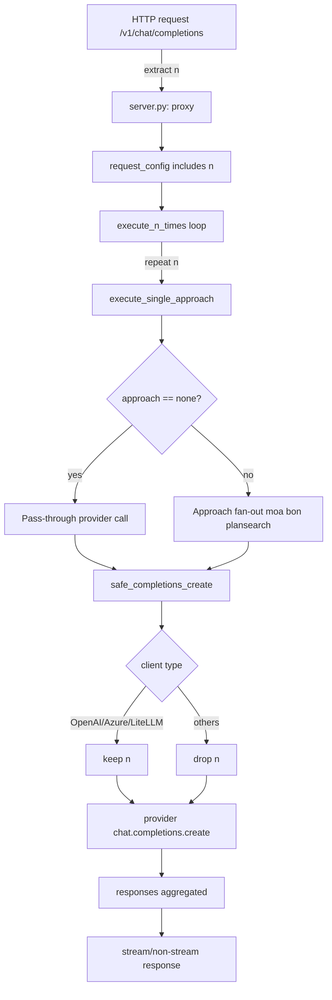

# `n` parameter behavior across providers

## Overview

`n` is the OpenAI chat-completions parameter that returns multiple choices in a single response. Its support is provider-specific. This note captures what works today in OptiLLM and what to prefer going forward.

## Current OptiLLM handling

-   In `safe_completions_create`, `n` is **kept** only for OpenAI/Azure and LiteLLM clients. For all other clients it is **dropped** to avoid unsupported-parameter errors.
-   Approaches that need multiple candidates (e.g., `moa`, `bon`) already perform their own fan-out/parallel calls instead of relying on provider-level `n`.

## Provider/SDK specifics

-   **OpenAI / Azure**: `n` is first-class and returns `choices` of length `n` in one call. Costs scale with total generated tokens across all choices.
-   **LiteLLM**: Supports `n` for multiple choices from a single target model. Also supports fan-out to multiple models (router/batching). Combining fan-out with `n` yields multiplicative outputs (`n × #models`) unless constrained.
-   **Cerebras SDK**: No documented `n`; calls go directly via SDK. OptiLLM drops `n` before sending.
-   **Z.ai SDK**: Public docs do not list `n`. OptiLLM drops `n` before sending. (Today these calls are effectively free; we keep the direct path.)

## Where `n` flows in OptiLLM

-   **Request intake (`server.py`):** `n` is read from the request or config, placed in `request_config`, and governs how many times the pipeline is run via `execute_n_times`. The `none` passthrough approach can still receive `n` (but downstream provider filtering applies).
-   **Provider call sanitization (`safe_completions_create`):** `n` is kept only for OpenAI/Azure/LiteLLM clients; it is dropped for all others before allowlist filtering and retries.
-   **Approach-level fan-out:** Approaches that need multiple candidates handle their own fan-out instead of relying on provider `n`:
    -   `bon.py` (Best-of-N): spawns `n` parallel candidate generations (diverse temps/models) and then rates/synthesizes.
    -   `moa.py`: runs multiple specialized agents and synthesizes; does not depend on provider `n`.
    -   `plansearch` / `re2` receive `n` from server config to control internal search/iterations.
    -   `execute_n_times` in `server.py` repeats the whole pipeline `n` times for SINGLE/AND/OR ops, aggregating responses and tokens.
-   **Local inference (`inference.py`):** maps `n` (when present) to `num_return_sequences` for local models.
-   **Plugins:** Majority voting / selection plugins may pass `n` as their own candidate count; provider sanitization still applies when they call out.

## Guidance for use

-   Need multiple samples from one model (OpenAI/Azure/LiteLLM): pass `n > 1`.
-   Need multiple samples for other providers: let approaches fan-out (current pattern) or issue multiple calls.
-   When using LiteLLM router/fan-out, be mindful of combined explosion when `n > 1` and multiple models are involved.

## Future direction (optional)

-   We could route Cerebras/Z.ai through LiteLLM and rely on `n`/router fan-out there, simplifying provider-specific branches. For now we retain direct SDK calls (cheap for Z.ai) and explicit fan-out in approaches.

## Flow diagram

## Usage patterns (detailed)

-   **Pipeline repetition (`execute_n_times`)**: Runs the entire SINGLE/AND/OR pipeline `n` times; OR branches can yield multiple responses per iteration; totals are aggregated.
-   **Approach-level fan-out**:
    -   `bon.py`: spawns `n` parallel generations (diverse temps/models), then rates and synthesizes.
    -   `moa.py`: orchestrates multiple agents, synthesizes final answer (not provider-`n` dependent).
    -   `plansearch` / `re2`: use `n` to control internal search iterations.
-   **Provider layer (`safe_completions_create`)**:
    -   Keeps `n` only for OpenAI/Azure/LiteLLM; drops for others before allowlist filtering.
    -   Retry path re-drops `n` for unsupported clients.
-   **Local inference (`inference.py`)**: maps `n` to `num_return_sequences` when present.
-   **Plugins**: If a plugin issues its own calls with `n`, provider sanitization still applies; majority-voting plugins may set their own candidate count.

## Edge considerations

-   Combining LiteLLM router fan-out with `n > 1` can multiply outputs (`n × #models`); constrain either `n` or model list to control cost/volume.
-   For non-OpenAI providers (Cerebras/Z.ai SDK), `n` is ignored upstream; rely on approach fan-out or multiple calls.
-   The `none` passthrough can carry `n`, but unsupported providers will drop it in `safe_completions_create`.
